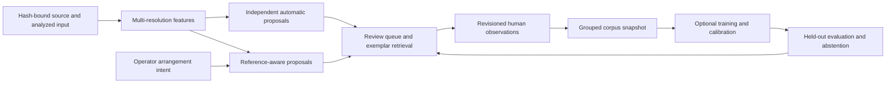

# Future guitar phrase and audio classification

Status: proposed design, October 6, 2026. Owner `/root/classification_future`;
root integrates. Authority: operator's explicit future planning and parallel
lane request; repository AGENTS.md; R-HOOK-CONVERGENCE-20261004 / R-N13.
This design admits no tool, model, package, service or trained classifier.

## Product decision and current evidence

Build a reference-aware review loop around durable musician labels, while
retaining independent automatic discovery. The MVP arrangement supplies weak
supervision for structure and technique, rather than exact acoustic boundaries,
intended note events or a complete error score. Model work should first improve
phrase retrieval and useful review proposals; performance grading needs its own
intent and calibration gates. Primary-source candidate research is in
[AUDIO_CLASSIFICATION.md](../../research/AUDIO_CLASSIFICATION.md).

Existing local components are `review_server.py`, the typed review hook,
`corpus.py`, automatic phrase discovery/comparison, arrangement comparison,
optional Basic Pitch, pYIN and PCEN experiments. The review store currently
accepts categories `rhythm`, `phrase`, `tone`, `noise`, `other`; its accepted
observation status does not establish a confirmed musical mistake. Corpus
validation checks metadata consistency, not listening or label correctness.

The canonical [demo arrangement](../../../program/demo-arrangement.json) and
[verbatim prompt](../../agent-notes/2026-10-06-operator-arrangement-prompt.md)
are operator intent: 404 expected clicks, approximate 10–11-second phrase
anchor, uncertain first breakdown execution and presumed second-chorus count.
Do not synthesize detections to fulfill this total. The opening includes fan,
setup guitar/amp sounds and possible metronome windup; unreviewed opening audio
cannot become an all-noise training example.

Evidence limits that future evaluations must retain:

- [Phrase localization diagnostic](../../agent-notes/2026-10-06-phrase-localization-diagnostic.md):
  saved palm recurrence proposals had zero reference overlap in the inspected
  generated cases; broad/submotif legato matches are not full phrases. Clock
  arithmetic did not explain the failures. Keep proposal support separate from
  boundary refinement and do not repair timestamps with truth-derived offsets.
- [Learned pitch pilot](../../agent-notes/2026-10-06-learned-pitch-numerical.md):
  missing-F0 native C1 matches were 34/426 with 392 octave errors; native absence
  support was zero. The earlier 0/258 pointwise proxy is a different experiment.
  Generated sweep/tapping signal proxies do not qualify physical techniques.
- [XOD proof](../../research/XOD_SPECTROGRAM.md): default PCEN reduced the
  selected synthetic clean/mix flux cosine in all three cases; this diagnostic
  is not onset precision/recall. [Actual characterization](../../agent-notes/2026-10-06-pcen-actual-transfer.md)
  establishes finite features and block/batch parity, with no reviewed technique
  or correctness labels and no winning frontend.

## Labels and a user timestamp

Use independent axes, permitting overlap and uncertainty:

| Axis | Examples | Meaning |
|---|---|---|
| Structure | phrase ID, recurrence family, verse, chorus, breakdown, rest | Intended arrangement and/or observed span, with separate provenance |
| Technique | open-string, palm-muted, chug, falling pinch harmonic, tapping, two-hand tapping, sweep, legato | Multi-label candidates; audio may not distinguish hand technique |
| Issue | rhythm, melodic, phrase extent, articulation, capture artifact | Family of a user observation or review proposal, not inferred wrong notes |
| Evidence | operator assertion, reviewed observation, model proposal, ambiguous, dismissed | Who supplied a claim, its state and alternatives |
| Coverage | reviewed span, uncertain boundary, censored end, unreviewed, unsupported | Limits which positive/negative/evaluation claims are eligible |

Technique and correctness are separate targets: deliberate syncopation is not
a rhythm issue; a sweep is not an error; timbre changes can explain apparent
recurrence differences. An audio-only label for two-hand tapping may remain
ambiguous with ordinary tapping; optional reviewed video evidence must be bound
to the same source/timeline and explicit modality.

For “known melodic or rhythm issue at xx.xx”, the agent must save the exact user
assertion through the existing review primitive where supported. A future typed
extension should add issue subtypes and evidence provenance, preserving existing
stores and revision checks. Until that extension exists, use supported categories
and the note text; `melodic` is not a valid current category. Never silently send
new fields to the closed current schema.

Align issue subtypes and evidence basis with
[OVERLAYS_AND_ANNOTATIONS.md](OVERLAYS_AND_ANNOTATIONS.md):
`rhythm_timing`, `rhythm_pattern`, `phrase_omission`, `phrase_duration`,
`melodic_pitch`, `articulation`, `rest_execution`, `meter_mismatch`;
basis `operator_context`, `operator_assertion`, `detector_hypothesis`,
`reference_comparison`. Capture/tone observations retain their review context.
User-confirmed labels render as user reported, with explicit operator certainty;
they do not claim detector confirmation.

The proposed label record adds source SHA-256, explicit timebase, finite source
start, nullable end, boundary uncertainty, user text verbatim, issue/technique
axes, author role, UTC supplied/reviewed time, label revision and evidence links.
A point timestamp stays a point when no end was supplied; any audition window
around it is a separate display choice. “xx.xx” without units is interpreted
only from an explicit UI/agent seconds convention; ambiguous clip-relative vs
source coordinates require clarification before saving. Source seconds include
the original stream origin; playback coordinates require explicit conversion.

Operator confirmation can label a known issue for supervised data, with its
author and assertion retained. It must not overwrite an automatic hypothesis,
establish the exact mistaken note, confirm other unreviewed spans, or accept the
master. Updating an annotation creates a traceable revision; training receipts
continue to bind the old immutable snapshot or become stale visibly.

## Semi-supervised workflow and graph

1. Register exact source, analysis-input and producer hashes; use source-bound
   decoded/restored variants, preserving original rate/channels in delivery.
2. Run fixed independent discovery without arrangement labels, expected lengths,
   named section cues, held-out labels or intended BPM supplied through side
   channels. Seal proposal/feature artifacts before scoring.
3. Run an explicitly separate reference-aware alignment branch that can consume
   approved arrangement intent. Retain unmatched, extra, missing, ambiguous and
   partial-tail regions instead of coercing the baseline to match.
4. Present phrase candidates and nearest reviewed exemplars with source spans,
   alternatives, raw scores and confidence only where calibrated. Prioritize
   uncertainty and diverse takes for review; do not call this a correctness grade.
5. The musician confirms, edits or rejects labels. Snapshot the revisioned corpus,
   then train/calibrate an optional retrieval head or small multi-label model.
6. Evaluate on held-out groups before exposing a new default. Pseudo-labels are
   separate records with parent model identity and weight; human labels never
   become indistinguishable from propagated labels. Disable pseudo-labeling for
   an unvalidated class or capture domain.

Future balance/EQ/mastering outputs are new analyzed inputs and require feature
regeneration; their labels remain on the common original clock. Every variant
of a parent take belongs to the same corpus split. Analyze raw and restored
versions as explicit conditions so a model cannot hide damage behind timbre
normalization. Real-time AU processing does not run this offline graph.

## Feature and model priorities

Start with the locked log-mel baseline, timing/recurrence evidence and a small
exemplar retrieval experiment. Add longer low-register spectral features as a
separate branch rather than replacing short attack features. At 16 kHz,
1024/4096 FFT spacing is 15.625/3.90625 Hz and 64/256 ms support; the C1-to-C#1
gap is about 1.94 Hz. Coarse mel triangles further limit separation. A longer
FFT alone therefore does not establish C1 note identity; short/long branch
fusion needs explicit support and temporal blur. Preserve raw low-band energy,
sustain and pitch ambiguity alongside contrast-normalized PCEN.

Bounded PCEN ablations must declare magnitude/power, input scaling, mel bank,
FFT/window/hop, centering, smoother/warm-up state and axes. The existing
[XOD lane](../XOD_SPECTROGRAM_LANE.md) owns that experiment; do not duplicate
its budget. PCEN transforms analysis features and is not audible denoising.

| Candidate role | Proposed use | Qualification needed |
|---|---|---|
| Deterministic features + nearest exemplars | Same riff/technique review retrieval | Grouped held-out retrieval labels, nuisance negatives, ranking calibration |
| Small multi-label classifier on fixed features/embeddings | Technique/capture proposals | Adequate independent labels, open-set/ambiguous cases, per-class calibration |
| Optional Basic Pitch / pYIN | Pitch candidates and octave alternatives | Low-register and event support, source clocks; no articulation inference from MIDI |
| CLAP/music embeddings | Optional coarse audio/text or audio/exemplar retrieval | Exact checkpoint rights/runtime, low-string/timbre transfer evaluation |
| YAMNet-style transfer baseline | Optional general acoustic embedding control | Domain transfer; generic AudioSet labels do not supply technique classes |
| Audio-language model such as Qwen2-Audio | Optional bounded descriptions/proposal comparison | Model-specific audio runtime, conversion parity, timestamp hallucination tests |
| Text LLM / text embedding / text ranker | Parse user statements, discover tools, retrieve notes | Typed schema/source span checks; cannot hear guitar without audio encoder |
| Speech ASR model | Speech annotations if separately requested | Speech task evaluation; not musical transcription or guitar-error grading |

`llama.cpp` is a runtime rather than a classifier. Audio support requires a
supported model and its audio projector/encoder; a successful text endpoint or
GGUF file does not establish audio intake. Current upstream documentation
specifically cautions against Qwen2-Audio prequantized examples due to poor
results. Keep canonical and converted model evaluations separate.

## Local related work and boundaries

Read-only inspection found no `/Users/jess/git/sting` checkout. Sting appears
as a compute node in Blahaj source; no remote node/session query was made.
The inspected Blahaj SearXNG architecture discusses Qwen3-Embedding for text
search. Its timing/cost table is a planning claim, not measured audio capability.
Current capacity, model serving, ranking work and the other Codex session's
knowledge remain unknown; request a source receipt through the owner lane when
this integration is prioritized, without contacting other sessions implicitly.

The xoruby checkout `/Users/jess/git/xoruby-2026-tin5128` contains a documented
public-audio recipe reconstruction with trainable PCEN, a ResNet-18 multi-label
head, recording-level splits, Ruby/Python feature parity and ONNX inference
receipts. Its bird-target task and 400-Hz lower bound do not transfer guitar
accuracy or low-C1 coverage. Reuse reproducibility/evaluation patterns only
after license/scope review; no private historical training substrate or sibling
implementation was copied. The private xoxd-spectrogram has unresolved
redistribution licensing, documented in the existing XOD research.

The user's “runes” may refer to Svelte UI reactivity or another classification
project. No matching local audio-classification source was established by the
bounded search. UI runes can bind controls and progress; that is separate from
an audio model. Preserve this as an unresolved integration pointer, rather than
invent a dependency or claim an existing model.

## Corpus, leakage and evaluation

Require clip rights/consent and source hashes; record exact code, model,
checkpoint, license, dataset and processor revisions. Artist reference tracks
are tone context, not training authorization or isolated-guitar truth. No raw
recording, user identity, model weight or private label text enters public CI.

Split by musician/session/take family, with original, repaired, denoised,
remastered, excerpts, augmentations and repeated motifs kept together. Report
separate within-take recurrence and held-out-take/generalization results. Keep
synthetic generator families/seeds separated as well; synthetic success never
qualifies real technique. Training, validation and calibration choose settings;
test cohorts remain untouched until predictions are sealed. A consumed test is
diagnostic and requires a new cohort for confirmation.

Unlabelled spans contribute no negative labels. Explicit reviewed absence,
rest, fan-only, metronome-only and uncertain mixture labels have different
eligibility. Partial-frame/window support, low-frequency suppression, overlapping
techniques, label disagreement and unavailable classes remain exclusions with
reasons. Canonical arrangement labels cannot enter the independent test branch;
reference-aware evaluation reports the amount of supplied intent separately.

Report phrase boundary precision/recall and MAE with tolerance; span IoU; missed
and unsupported proposal coverage; recurrence retrieval precision/recall@k and
rank; per-technique multi-label precision/recall; reviewed-negative false calls
per minute; issue-family span precision and review yield; calibration error and
selective risk/coverage; disagreement and abstention. Every metric carries
numerator, denominator, eligible duration and source group; N=0 stays null.
Do not optimize only aggregate accuracy or all-negative abstention. Rhythm
offset evaluation requires the selected detector's latency calibration and
explicit expected attacks; melody correctness requires sufficient note intent.

Raw cosine/logit/sigmoid outputs are model scores. A nullable calibrated
probability needs its calibration dataset, version and domain; use validation
thresholds, unknown-class rejection and user review, retaining low confidence
and disagreeing alternatives. Model rankers prioritize review and tool choice;
their rankings cannot create musical ground truth.

Property/metamorphic checks should cover source-time shifts, tempo stretch with
corresponding truth transformation, duplicate variants grouped in one split,
missing/extra boundaries, source mismatch, stale revisions, reordered metadata,
partial coverage, unknown techniques, overlapping labels, zero denominators,
reference removal, model/prediction hash drift and PCEN streamed state. Musical
detectors may abstain or change outputs after EQ/noise; tests must not require
exact 404-click agreement or artificial invariance to destructive processing.

## Future tool, resources and milestones

Proposed analysis-only request: source/input/producer hashes, explicit source
ROIs and timebase, feature/model/settings registry IDs, immutable label-store
hash and revision, optional reference routed to the named reference branch,
maximum duration/windows/output bytes, worker/thread/deadline limits. Return
immutable proposal/evidence paths, actual coverage/support, raw score,
nullable calibrated confidence and abstention reasons. This is a design sketch,
not a current callable API. Fit the capability owner's approved schema before
registry admission; expose the same validated knobs to CLI/MCP/web UX.
The [backend design](WEB_BACKEND.md) owns the job envelope, stable source and
artifact identifiers, reference IDs and idempotency. Resolve those identifiers
to the immutable hashes above on the server; labels and all take variants must
retain their original parent and grouped split.

Never train or download models during an upload request. Explicit model-byte,
rights/runtime, resource, quality and publication receipts precede adoption.
Initial optional CPU feature/retrieval trials use one worker/two numeric threads,
at most 30 audio-seconds and a 600-second whole-job deadline, with preregistered
RSS/output caps. Larger pretrained models require an exact admission envelope
and existing approved builder/cluster capacity review; this design adds no
host daemon, deployment, GPU reservation or sibling mutation.

| Priority | Bounded deliverable | Estimate | Gate |
|---|---|---:|---|
| Shared sprint core C0 | Label/provenance axes, source-time contract, split manifest template, baseline evaluation denominators and synthetic contract checks | 4 h | 1 h each: contract, grouping/coverage, fixed evaluator plan, checks/readback; no learned inference |
| Optional extension C1 | One fixed-feature exemplar retrieval slice with human review and held-out ranking evaluation | 8–12 h | Reviewed labels in relevant classes and independent held-out groups; label acquisition time separate |
| Existing optional XOD lane | Fixed PCEN/low-register/window ablation | 5–7 h | Existing preregistration and separate held-out support; avoid double counting |
| Later C2 | Small multi-label head, calibration and active-review queue | Scope after corpus inventory | No pseudo-label promotion; adequate positive/negative support per class |
| Someday C3 | Qualified audio-LLM or CLAP comparison, optional multimodal technique branch | Scope after candidate admission | Rights, hash-bound runtime/input parity, measured resource envelope and held-out guitar transfer |

Proposed operational objectives: complete source/settings/model lineage for
every accepted artifact; zero cross-split take variants; zero confirmation of
unreviewed mistakes; retain every failed/partial run; abort beyond admitted
resources with a durable receipt. Treat these as contract gates, not deployed
SLO measurements. Set latency percentiles, false-positive budgets and per-class
quality targets only after representative measured jobs and reviewed held-out
labels. There is no guitar accuracy SLA today.
