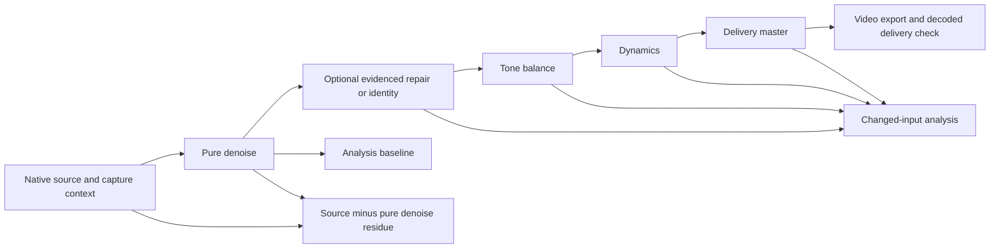

# Mastering, balance and capture-response design

Owner `/root/mastering_future`; October 6, 2026. Authority: operator's full
continuation, future design and remastering request; AGENTS.md,
R-HOOK-CONVERGENCE-20261004 / R-N13. Status: proposed design plus one bounded
current-schema comparison setting. No DSP, accepted master or host proof is
created by this document. Root integrates; `audio_research` owns actual numerical
comparison and the separately released fuller candidate.

## Problem and user outcome

The operator reports that processed audio lacks low end, has unbalanced EQ and
sounds thin/nasal rather than thick/full. Persist this as operator listening
feedback about the current output, with exact candidate identity unresolved
unless a listening annotation binds it. A future take should retain the
nine-string instrument's weight, attack, saturated texture and sustain while
reducing fan interference, then offer reversible balance/dynamics adjustments
and a shareable video. Tonal completeness is a review gate alongside noise
cleanup and musical markers.

The tuning remains C1 F1 Bb1 Eb2 Bb2 Eb3 Ab3 C4 F4; C1's theoretical frequency is
32.703195663 Hz, not a measured played fundamental. Phone/webcam capture may
already lack low-frequency content or have automatic gain/codec/room coloration.
EQ cannot uniquely invert an unknown recording chain, recreate clipped/absent
content, or establish an authentic amplifier response. Added harmonic/sub-bass
content, if ever offered, must be an explicitly creative branch.

## Current evidence and immediate candidate

Current NR8/NR10 profiles use reviewed capture 4.10–4.95 seconds, NF −40 dB,
adaptivity/gain smoothing zero; only reduction 8 versus 10 dB changes in the
causal pair. Both use 300 Hz −1.5 dB/Q0.8, 2200 Hz +1 dB/Q0.8, compressor
threshold −18 dB, ratio 2, attack 15 ms, release 100 ms, knee 3 dB, fixed 25%
wet and no makeup gain. Native source is 44100 Hz mono, 6,657,385 samples.
Delivery targets are −18 LUFS / −1.75 dBTP. The independent saved NR10 audit
records final AAC −18.01 LUFS / −1.75 dBTP and preserved native extent; it
does not establish accepted tone. See the [refinement contract](../RESTORATION_REFINEMENT_LANE.md)
and [artifact audit](../../agent-notes/2026-10-06-actual-nr10-resource-independent-artifact-audit.md).

At this design checkpoint the fresh paired NR8/NR10 measurement has not run.
`audio_research` reports historical NR8 mixture-band reductions of approximately
2.0–2.8 dB at 20–45 Hz in fixed active windows, with coherence around .95;
those mixtures do not separate musical bass from fan. Existing evidence and
the new comparison method are [retained separately](../../agent-notes/2026-10-05-nr10-restoration-comparison-method.md).
The first five seconds contain setup guitar/amp sounds and possible mechanical
windup; neither that description nor the capture selection establishes pure
fan audio.

**FULLER-v1** is one bundled tone hypothesis, evaluated after the causal NR
comparison. Its basis is the exact NR8 pure denoise artifact, without selecting
NR8 as the preferred denoiser. All capture/reduction/source/native controls stay
identical; replace the current peaking EQ list with:

```json
[
  {"frequency_hz": 160, "gain_db": 2, "q": 0.7},
  {"frequency_hz": 300, "gain_db": 1, "q": 0.8}
]
```

Remove the 2200 Hz boost. Keep the compressor and −18 LUFS / −1.75 dBTP targets
unchanged. The 160 Hz bell tests body/harmonics and the 300 Hz change reverses
the current body cut; their exact subjective effect remains unknown. Neither
establishes preservation/restoration of 32 Hz. Multiple EQ changes mean a result
can support this bundle's preference, not attribution to one band. A later
single-band ablation can separate causes if useful. No shelf, new filter schema,
limiter, subharmonic generator, blanket high-pass or notch is part of this trial.

Before any root-released render, bind exact source, parent, profile, capture
review, authoring/application receipt, producer revision and candidate identity.
Verify pure `denoised.wav` byte/hash identity with the fixed basis: otherwise the
comparison is confounded and must report that difference. Preserve original,
existing master/latest, NR8/NR10, pure residue and rejected/partial runs.

## DAG and immutable stages



Repair denotes a future explicitly reviewed operation, such as an identified
capture glitch; current implementation need not invent a repair stage. Intended
distortion and pick transients must never trigger automatic declipping/declicking.
Keep metronome attenuation a separate experimental branch because it can
damage coincident attacks. Retain metronome-bearing analysis for pulse evidence.

Every stage receipt records upstream hashes, implementation/version, native
clock mapping, exact controls, measured latency/extent, completion state and
outputs. Tone, compression, normalization and codec encoding can change analysis
features: recompute or explicitly invalidate downstream evidence after a change.
Use pure denoise as the default analysis baseline and name any delivery-input
analysis separately. Source timestamps remain invariant; altered amplitude or
frequency-dependent phase does not authorize an alignment fitted for better
metrics. A single latency scalar cannot certify all-frequency acoustic alignment.

Pure `denoised.wav` and source-minus-denoise `residue.wav` retain their current
meaning. Future separate repair/EQ/dynamics/master artifacts make attribution
reviewable; the current `processed.wav` combines EQ plus compressor and should
be described that way until split-stage support exists. Delivery normalization
is not a surrogate for tonal balance.

## Distinguishing removal damage from capture limitations

Compare native source → pure denoise → processed pre-gain → final PCM → decoded
AAC on exactly the same source-timed passages. Use pre-gain measurements for
causal changes; use constant, recorded presentation gains for listening. A
louder rendered file must not be allowed to win the tone comparison by level.
Use one gain per complete candidate, selected on the same frozen review region;
do not normalize each phrase independently and hide pumping/decay changes.

| Evidence | Interpretation and next action |
| --- | --- |
| Low-region power decreases source→pure denoise and residue has low guitar-like sustain | Possible removal damage; reduce suppression or improve source-bound capture/protected-low treatment before boosting EQ. Musical content remains a listening observation until supported. |
| Raw source already sounds thin and same chain has little coherent low signal | Possible capture/placement limitation; retained high harmonics can aid perceived body, but cannot prove the missing fundamental existed. Collect a paired reference. |
| Pure denoise retains body, processed loses it | Isolate EQ and compression with bypass/one-stage comparisons; check 300 Hz cut, 2.2 kHz boost and envelope changes. |
| PCM is satisfactory, AAC sounds different or fails peak checks | Examine encoding and decoded delivery; retain codec padding/rate/peak evidence separately. |
| Only band power or coherence suggests a difference | Describe mixture change; leave fan-only/music-only gain null and defer preference to listening. |

Keep the [frozen NR method](../../agent-notes/2026-10-05-nr10-restoration-comparison-method.md):
Welch/coherence bands 20–45, 45–120, 55–70, 190–225, 250–2000, 2000–10000 and
10000–Nyquist Hz; native fixed active windows 10–20, 40–50, 90–100 and 130–140
seconds plus its existing quiet/tail/attack panels. Repeat no completed actual
comparison merely to fit this spec. Sparse historic attack anchors are review
candidates, not validated guitar attacks. Source-weighted coherence is not a
musical amplitude-preservation score; finite mixtures cannot settle causality.

Listen at matched presentation level to source, pure denoise, the current tone
bundle, FULLER-v1 and unchanged-gain residue. Capture low-string weight, nasal
quality, pick separation, pumping, fan audibility, sustain, tapping, two-hand
tapping and sweeps as distinct ratings/annotations. Record monitoring device,
playback level, spans and candidate hashes; a phone speaker cannot validate
physical reproduction of 32 Hz. Blind candidate labels where practicable.
Permit neither/all preference and uncertainty; no automatic quality winner.

## Controlled capture/reference protocol

Record source-bound phone/webcam metadata, microphone position/orientation,
distance, room, fan placement, available capture processing controls, amp/cab
settings and guitar settings. Unknown device high-pass/AGC stays unknown. Keep
room-tone listening notes separate from a measured microphone transfer function.

For new takes, include a deliberately guitar-free short fan-only capture, a
separate fan-off background when practical, then fixed low-string sustain,
palm-muted chugs, open phrases, tapping/legato and sweeps at unchanged settings.
Do not retroactively classify the existing opening as that controlled sample.
If available, record a simultaneous calibrated/characterized full-range mic
and the phone/webcam; optional DI documents performance but does not by itself
measure the room amplifier spectrum. A shared sync event establishes a starting
offset, while drift and acoustic path differences need measurement. Preserve
independent clocks and avoid confusing delay correction with phase inversion.

Compare the same performance and annotated sections at matched levels. A
bounded reference-response estimate requires adequate signal-to-noise,
coherence/coverage, stable settings and headroom. Regularize gain and reject
deep nulls instead of attempting unbounded inversion. Unknown/absent lows remain
unknown; recommend recording improvements if the capture is insufficient.
Artist full-band references remain qualitative context because bass, drums,
mix/master, room and microphone responses contaminate an isolated guitar target.
See [tone context](../../research/GUITAR_TONE_REFERENCES.md).

## Typed controls for agent, UI and later AU

The same versioned control definitions should feed MCP JSON schema, CLI args,
UI widgets and an AU parameter map where a real-time equivalent exists. Current
controls below reflect admitted worker limits; future controls require their
own implementation, skill, bounds, migration and evidence before discovery can
advertise them as usable.

| Stage | Current controls | Future extension and requirements |
| --- | --- | --- |
| Denoise/capture | Source/run/review hashes; reviewed capture interval; reduction/floor/adaptivity/gain smoothing under current schema | Named protected-low policy with measured effect, not a magic fullness slider; show contamination/removed-signal review. |
| Parametric EQ | ≤3 peaking bands, 160–6000 Hz and below native Nyquist; gain ±3 dB; Q .5–2; omission bypasses | Closed bell/low-shelf/high-shelf enum; proposed bell 20 Hz–min(20000, .45×rate), shelf anchor 40–160 Hz, gain ±3 dB and Q .5–1 initially. Qualify 32 Hz response and headroom first. |
| Dynamics | Threshold −36..−6 dB; ratio 1..3; attack 8..20 ms; release 60..200 ms; knee 0..6 dB; fixed 25% wet, no makeup | Independent wet 0..50% only after bounds/fixture proof; meter actual reduction. Sidechain low sensitivity is a separately qualified feature. |
| Delivery | Integrated loudness and true-peak controls under current profile; native rate/channels/extent retained | Named export targets and encoded readback. Future limiter requires measured delay/tail/true-peak evidence; no hidden auto-leveling. |
| Review | Exact immutable candidate/annotations; original/denoise/residue/processed/delivery selection | Gain-matched A/B, reset/bypass, changes summary, monitor warning when low-band audition is physically limited. |

Reject nonfinite values, booleans masquerading as numbers, unknown fields,
invalid Nyquist combinations and arbitrary executable/filter text. Use named
local artifact selectors rather than paths supplied by an unauthenticated web
client. Show stage intent and supported bounds in UX; retain advanced controls.
Future shelf defaults to bypass. A first experimental 80 Hz/+1.5 dB/Q.7 shelf
could be tested after qualification, but is unsupported by today's schema and
must not be forwarded to tool25 or `apply_capture_profile`.

Offline FFmpeg remains the media/filter engine. Rust owns reusable future
native EQ/dynamics primitives; the later Swift AU shell can share validated
controls without invoking FFmpeg, I/O, allocation, locks or model work in render.
Offline normalization/whole-take fan profiling and analysis are not AU render
features. Smooth validated EQ/dynamics automation with preallocated state,
measure changed-block/rate/parameter behavior, and verify native-host latency,
bypass/state and listening separately. Research candidates and licensing are
listed in [the primary-source note](../../research/MASTERING_CAPTURE_RESPONSE.md).

## Proposed milestones, SLOs and ready ticket bodies

These are planning allocations within the root 35-hour/70-hour portfolio,
not extra hours, performance promises or published Linear issue IDs.

| Ticket title | Allocation / priority | Concrete completion evidence |
| --- | --- | --- |
| Bind thin-tone feedback and stage attribution | Core35: 1 h / P0 | Exact candidate review, upstream hashes and existing-stage comparison; uncertainty retained if candidate unknown. |
| Render and review bounded FULLER-v1 | Core35: 2 h / P0 | Existing-schema immutable candidate; fixed denoise identity, common-region matched gains, all active/tail/residue panels and operator preference. |
| Expose tone-stage provenance and A/B controls | Core35: 2 h / P1 | Report/API design with pure-denoise vs processed vs delivery selectors, analysis invalidation and exact controls; smoke demonstration only if implemented. |
| Qualify low-aware EQ and split-stage artifacts | Extension70: 4 h / P1 | Versioned schema, Rust/FFmpeg response comparison, shelf/headroom/native-clock/property evidence; no default tone adoption. |
| Specify paired room/phone capture and reference review | Extension70: 2 h / P1 | Capture checklist, metadata/reference selectors, missing-data rules and one real pair if supplied; acquisition absence remains open. |
| Add dynamics telemetry and bounded automation | Extension70: 2 h / P2 | Actual reduction envelopes, wet bounds/attack-tail fixtures and same-control UI/MCP mapping; AU acceptance stays separate. |
| Reference-assisted response estimation / creative bass / native mastering AU | Someday / P2 | Separate data/intent/model or DSP qualifications and real host/listening receipts. No authentic-bass recovery promise. |

Proposed acceptance/SLO gates: 100% completed stages have verified upstream and
output hashes, exact controls and native extent; every changed processing input
invalidates dependent analysis; all delivered candidates retain originals and
pass finite/native/timeline checks. Existing delivery comparison gate remains
decoded AAC −18±.3 LUFS and ≤−1.75 dBTP. Proposed A/B gain-match tolerance is
≤.3 LU over the frozen review region when meter input is defined; otherwise mark
unmatched and report the reason. LU matching does not establish equal perceived
sub-bass. Report final true peak after encoding.

Generated fixtures should exercise stable bounded EQ gain/response at C1 and
harmonics, bypass/null identity, finite coefficients/output, response versus
predicted filter, timing/rate/channel preservation, attack/tail and automation
discontinuities, Nyquist rejection and cancellation/partial receipts. Pure EQ
gain expectations apply to tones/impulses; compressor tests need level/envelope
oracles rather than a false linear frequency-response promise. Known-component
noise/guitar fixtures can support component-specific preservation; real mixed
audio remains mixture-only. Predeclare thresholds before comparing candidates.

Do not assign a processing-latency SLO from these historical single-machine
renders: NR8/NR10 completion is roughly 347/513 seconds for this 151-second take
in separate resource conditions. Establish percentile turnaround by job class,
duration and declared hardware only after representative profiling; cancellation
and cleanup have explicit bounded implementation budgets. Subjective quality
requires operator review even when all numerical delivery gates pass.

Receipt: `mastering_future | two new design/research documents only |
operator thin-tone feedback, future DAG and UI/agent controls | R-N13 |
current NR8/NR10 artifacts audited, paired measurement pending |
FULLER-v1 proposed to audio_research; no DSP, accepted master, installation,
publication or tracker mutation by this lane`.
