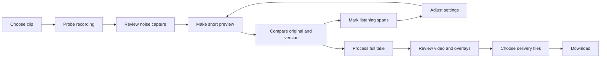

# Future guitar-practice web UI

Status: design proposal, October 6, 2026. This file records the operator's
requested web direction; it does not activate a web release or replace the
current local CLI/report workflow. Rust DSP, FFmpeg media work and bounded
Python analysis remain the processing owners. Related future backend and marker
specifications own their schemas; UI names below are proposed presentation
contracts, not already callable tools.

## What exists now

The current graphical workflow starts with an existing run, using
`just review RUN_DIR [PORT]`. `scripts/review_server.py` binds Python's
`ThreadingHTTPServer` to `127.0.0.1`; `review/index.html`, `review/app.js` and
`review/style.css` implement a plain HTML/JavaScript screen. Its actual features
are:

- Verified original, clean, removed-signal and video players when available;
  switching retains the source position and pauses other players.
- Source-time seeking, numeric start/end selection and looping a marked span;
  seeking or selecting a proposal never starts playback.
- Candidate span track and list, filtered by kind and heuristic confidence.
- Source-bound listening notes in phrase, rhythm, tone, noise and other topics;
  states are needs review, recorded observation and dismissed candidate.
- Revision-checked saves to `review-annotations.json`, editing, refresh and
  JSON download. Origin/token checks protect local mutations.
- Declared tempo and fitted pulse context, source identity and explicit limits
  on performance-error and master-acceptance claims.

`scripts/report.py` separately creates a static local report with audio/video,
waveform/timing evidence, source-time navigation and available artifact downloads.
The static report does not submit processing jobs. Neither screen currently
offers clip upload, noise-capture authoring, live EQ/compression controls,
durable job submission, authenticated multi-user sessions or a notation editor.
The review UI's noise/tone note categories do not constitute processing controls.

## Product decisions

First improve the existing screen for the actual demo: its thin/nasal tone
complaint and arrangement review are immediate musician needs. A future web
workspace should preserve that comparison and source-time behavior, add guided
processing steps, and keep controls tied to supported tool arguments. A frontend
framework migration is not required to correct current tone or review labels.

The interface should answer four questions without opening implementation logs:
what recording am I hearing, what changed in this version, where should I
listen, and what can I download? Processing evidence remains available in a
details panel. Staff notation is a later view that requires its own validated
pitch/rhythm mapping; an automatically inferred staff must retain unknowns.

The requested ezgif-like lifecycle supplies the familiar sequence of upload,
inspect, configure, preview, adjust and save. It does not require uploading
private recordings to ezgif. Its video converter visibly starts from a file or
URL and continues to conversion controls. [ezgif video workflow](https://ezgif.com/video-to-gif)

## Concrete wireflow

| Screen / state | Visible content and primary action | Persistence / failure behavior |
| --- | --- | --- |
| Choose clip | File chooser and drop target; supported formats, configured byte/duration limit and where processing occurs; **Inspect clip** | Local mode says files stay local; hosted mode names the upload destination and retention before transfer. Partial uploads are distinct from accepted sources. |
| Probe recording | Thumbnail, duration, audio presence/rate/channels and timing status; choose **Continue** or replace clip | Original is immutable; a source identity is established before analysis. Unsupported codecs/no audio have actionable errors. |
| Review capture | Opening waveform/video with a selected source interval; **Listen to capture**, **Use reviewed interval** or **Skip capture** | First five seconds contain setup guitar/amp sounds and possible windup; never auto-confirm as pure noise. Mark contamination/uncertain status. |
| Configure preview | Simple cleanup amount plus advanced supported settings; choose a phrase-sized preview interval; **Render preview** | Draft controls are local UI state. Submitted settings produce an immutable version and job. |
| Processing | Queue status, actual phase, elapsed time, useful receipt links; **Cancel this job** | Reconnection restores the same job; elapsed time and estimates are separate. Prior successful versions remain playable. |
| Compare | Original, denoised and tone/dynamics versions; matched audition levels; diagnostic removed signal separately; **Keep comparing** / **Process full take** | Source seek and span loop carry across supported players. Missing or unmatched comparison media is labeled, not silently normalized. |
| Review | Video, timeline tracks, phrase list and note editor; **Save note** / **Adjust version** | Manual notes and automatic candidates have distinct provenance. Save uses expected revision; conflict retains draft and shows refreshed saved data. |
| Delivery | Clean video, optional marked review video, native-rate WAV, marker JSON/CSV, note JSON and evidence bundle; **Download selected** | Only validated artifacts are offered. Pending rendering has explicit status. Downloading does not imply tone acceptance or confirmed mistakes. |

Starting from an existing run enters at Compare/Review, without repeat upload or
processing. After a settings change, retain original source-bound notes; label
analysis inherited from another processing input as stale until reanalysis
finishes. Source observations remain valid history while derived findings belong
to their exact analyzed version.

## Workspace layout and accessibility

Desktop uses one workspace: player and transport at the left, processing/review
inspector at the right, source-time tracks beneath. A short step indicator shows
Clip, Capture, Process, Review and Download. The inspector has Cleanup, Tone,
Markers and Notes tabs, with settings summarized near the selected version.
The selected span and original source timestamp remain visible in every tab.

At narrow widths, player, transport, step content and note editor become one
vertical column. The timeline may pan within its own labeled viewport; the page
does not gain horizontal scrolling. A persistent **Mark here** action creates
a timestamp draft without obscuring playback controls. Numeric fields remain
available when dragging is difficult. Mobile source switching pauses the old
player; playback follows browser gesture requirements.

Use semantic controls, a skip link, explicit field labels/units, visible focus,
dialog focus return and polite status announcements. Do not announce every
progress tick. Every draggable interval has numeric and keyboard alternatives.
Timeline markers also appear in a navigable list; color is supplemented with
text, shape and evidence state. Check 375px and 768px widths, 200% zoom, dark/light
contrast and reduced motion. Use at least 44px practical touch targets. These
are proposed acceptance checks, not claims about current accessibility conformance.

## Processing controls and argument binding

The same versioned capability schema must drive agent invocation and browser
controls. Each control records tool/argument identity, units, allowed range,
default, dependency availability and whether it changes audible output or only
analysis. UI ranges are derived from the tool contract; this design introduces
no invented dB, ratio or attack/release defaults. Hide incidental deployment
details, but explain unavailable models/tools when that changes available actions.

| Group | Simple presentation | Advanced arguments, once supported | Required review |
| --- | --- | --- | --- |
| Fan capture | Source interval, reviewed/contaminated/unknown state | Capture recipe identity and spectral measurements | Audible setup guitar/windup and uncertain noise-only status |
| Noise reduction | Cleanup amount, bypass, preview | Actual reduction/intensity, smoothing and capture settings exposed by the selected tool | Original vs denoised and removed signal; low-string weight, attacks, sustain and artifacts |
| Tone / EQ | Version comparison, optional broad tonal adjustment | Parametric band type, frequency, gain, Q; bounded low shelf where supported | Native low register near32Hz, nasal midrange complaint, full distortion texture; no blanket80Hz high-pass |
| Compression / balance | Bypass and version intensity when defined | Supported threshold, ratio, attack/release, knee, make-up and channel-link parameters | Chug transients, tapping/legato audibility, pumping and noise lift |
| Master delivery | Audition/delivery target and measured result | Supported loudness/peak settings, limiter behavior | Level-matched comparison, peaks/clipping and original timeline/rate/channels |
| Phrase / rhythm | Automatic or operator-reference comparison; reviewed span labels | Allowed tempo/reference/coverage/alignment settings | Intent vs observed boundary, uncertainty and skipped/rushed breakdown question |
| Feature display | Waveform, log-mel, optional qualified PCEN | Analysis recipe, time/frequency axes, scale, frame support and source origin | Display features remain separate from audible restoration and note correctness |

Unsupported settings remain unavailable with a short reason. Changing a slider
does not start a full-take render. **Render preview** submits a bounded job;
**Process full take** submits the explicit full-take version. Presets expand to
inspectable settings and can be reset. Agent-generated suggestions appear as a
reviewable draft identifying author, intended change and comparison span before
execution; direct user-requested processing can submit under the same contract.

Tone references describe goals such as low-string weight and separation. The UI
must not promise to recover the in-room amplifier sound from a phone capture or
derive a definitive EQ curve from full-band artist recordings. It should let
the musician compare improvements and record acceptance or unresolved complaints.

## Markers, uncertainty and manual issue entry

Offer independently toggled tracks for structure/phrase spans; pulse/BPM/meter;
tonal hypotheses; automatic rhythm/recurrence questions; user observations; and
capture/tone diagnostics. The exact kind inventory and overlay schema belong to
the marker lane. Nullable tonic/meter/BPM is shown as **Unknown**; half/double
pulse alternatives remain selectable hypotheses. Expected arrangement counts
are labeled **Intended** and detections **Observed**, including missing and
partial coverage. No padding or invented boundaries complete the404-click
reference.

The operator selected the **Compact** default for shareable marked video:
section/phrase label, BPM and brief issue badges. Detailed evidence stays in the
review UI. Unknown BPM is shown as unknown or omitted by explicit display
selection; no tempo is invented to fill the badge. It keeps the hands and
guitar visible; overlapping markers collapse to an issue count and list in the
interactive view. Error color is reserved for an explicitly supported verdict.
User-reported issues are labeled **User report**; automatic findings use
**Review candidate**. Enabling graphical labels previews placement before
rendering a separate marked video. The unmarked delivery remains available.

**Mark here** accepts a point or ordered source span, topic/issue kind, text and
optional candidate link. An agent receiving “known melodic or rhythm issue at
xx.xx” uses the same source-bound annotation operation, records that it is the
operator's assertion, and retains timestamp precision. Melody/notes, rhythm,
phrase length, technique, tone and noise can be proposed finer topics after the
annotation contract is extended; current UI categories remain the inventory
above. Saving a note does not promote an automatic inference to ground truth.
Out-of-range timestamps fail with the valid source range and preserve the draft.

A future staff view can synchronize selected source spans with supplied or
reviewed score events. Automatic pitch events with octave/string ambiguity use
explicit uncertainty or remain off staff. Do not fabricate readable notation
to imply a score exists. CC0 asset selection, license inventory and render-safe
icons are the overlay lane's deliverables; semantic labels remain necessary
even when icons are available.

## Frontend and service recommendation

Svelte5 runes fit local interactive state; a SvelteKit server frontend can bridge
to a private bounded-job API without owning DSP. `adapter-node` is an official
standalone server route. Flask, FastAPI, Rails or another server could wrap the
same primitives; their language does not make a CLI/MCP tool a safe public
endpoint. Artifact identifiers, validation, jobs and authenticated source
ownership must be added at that boundary. The backend lane owns the selection
and operational contract. [Svelte runes](https://svelte.dev/docs/svelte/what-are-runes),
[SvelteKit Node adapter](https://svelte.dev/docs/kit/adapter-node)

Use the operator's xoxd estate for Just/Nix/toolchain conventions, theme tokens,
accessible navigation and typed schema/runtime boundaries. Read-only inspection
of `/Users/jess/git/xoxd.ai` at HEAD
`5e081b2b1f8a69f69b1236057eb397954a84be5a` found a static brand scaffold,
`adapter-static`, Svelte5, Kit2 declarations, Effect3.21.2 and pinned
Skeleton4.15.2. Its empty Effect layer and decoding helpers are patterns, not a
job service or v4 compatibility proof. Do not copy an unchecked effect
environment cast into a new service boundary.

Effect4 is now reported stable by its official October1 release recap; the
requested Skeleton5 has an official migration guide describing theme/API
changes. Neither fact qualifies the combined stack in this repository. Pin
exact versions and prove render/hydration, component interactions and schema
decoding in an isolated fixture before frontend admission.
[Effect4 release status](https://effect.website/blog/effect-v4-rc-september-recap),
[Skeleton5 migration](https://www.skeleton.dev/docs/svelte/get-started/migrate-from-v4)

SvelteKit remote functions remain experimental in the current official docs.
Use them only as a thin qualified facade for submit/status/review/cancel calls;
retain stable actions/endpoints as a fallback. Pin the Kit major and its matching
configuration syntax: current docs describe Kit3 Vite config, whereas the local
xoxd scaffold uses Kit2-era config. Prove Effect4 Schema's selected validation
adapter against that exact remote-function input contract; a v3 documentation
example is insufficient. [Remote-function status](https://svelte.dev/docs/kit/remote-functions)

The existing [xoxd-spectrogram study](../../research/XOD_SPECTROGRAM.md) identifies
the private package and its missing explicit redistribution license. Integration
depends on license authority and a bounded ablation. Its default PCEN pilot
weakened the measured onset-envelope agreement on selected synthetic cases;
retain log-mel baseline and independent low-register evidence. A spectrogram
is an analysis view, not an audible remaster or validated note detector.

## Job/review UI state model

Adopt backend states: queued, validating, running, finalizing, succeeded, failed,
cancelling, cancelled, interrupted and needs_reconciliation. The client also
has uploading, draft and disconnected display states. **Disconnected** reports
unknown current server state; it never claims that a worker stopped. A
cancellation request shows cancelling until its owned job acknowledges the
terminal state. A failed optional analysis leaves a validated restoration
available with an explicit analysis failure.

Use durable source/run/version/job/artifact IDs at `/api/v1`; the browser never
submits arbitrary filesystem paths. For every selected version show source
identity, recipe version and usable artifacts. Job progress shows actual phase
and completed work counts where available; ETA is labeled estimate and can be
absent. De-duplicate submissions by request identity; reconnection cannot render
the same take twice. The details are delegated to `WEB_BACKEND.md`.

## Demonstrable acceptance and proposed UI objectives

No numerical objective below is a measured SLA. Establish a named browser,
machine, local fixture size and sample window before enforcing them. Processing
duration needs measured hardware/capture baselines and is owned by the backend
lane.

| Objective | Proposed target / qualification |
| --- | --- |
| Transport and marker responsiveness | p95 input-to-visible-control response ≤100ms over100 actions with a cached demo and at most1,000 displayed markers; measure layout/interaction separately from media decode |
| Durable note feedback | p95 save acknowledgment ≤1s over30 local saves; success only after committed write; network failure/conflict always preserves draft |
| Progress freshness | Connected client shows received phase changes within1s and detects a stale feed after5s; show reconnecting rather than a fabricated percentage |
| Source timing | Persist source coordinates within one source audio sample; preserve media offset mapping; browser/VFR visual seeking tolerance is independently measured and disclosed |
| Continuity | Reload/reconnect retains selected version and saved annotations; bounded draft recovery is demonstrated; cancellation never removes earlier validated artifacts |
| Accessible operation | Complete file-choice, span selection, note save and download by keyboard; labeled controls, focus visibility and screen-reader status checks; no autoplay |
| Delivery integrity | Each offered download names the version and artifact type; unavailable/unvalidated outputs are blocked; clean and marked video are visibly distinct |

End-to-end demonstration on the actual demo: choose clip; inspect rate/channels;
listen to opening capture; retain contamination uncertainty; render a short
preview; compare original/denoised/tone versions over chugs and tapping; mark the
suspected rushed breakdown as a user question; adjust one supported knob;
submit full-take processing; preview selected overlays; download unmarked video,
marked video and notes. Interrupt/reconnect and stale-note-revision cases must
preserve recoverable work. A captured walkthrough may use synthetic/private-safe
media; it is not proof of hosted service availability.

## Milestone placement

| Horizon | Ticket-ready scope / effort estimate | Dependencies / done |
| --- | --- | --- |
| Current discussion/design | This wireflow, current-UI inventory and compatibility research | Durable files only; no application/deployment work |
| Next-week core,4h | Make tone and arrangement review legible in the existing local screen; capture a staged local-artifact walkthrough | Tone and arrangement receipts; version identity, intended/observed/unknown labels, keyboard source notes; actual-demo review at375px/200%zoom, persistence and conflict behavior. Upload/capture/process fixture states are visibly labeled prototype; they do not imply a working job service. |
| Next-week stretch,6h | Qualify Svelte5/Kit/Effect4/Skeleton5 in an isolated boundary fixture | Exact locks, selected Kit major, schema adapter, SSR/runes, tabs/dialog focus, remote function vs stable-action fallback; explicit pass/fail receipt, no migration assumption |
| Someday, separately estimated | Authenticated upload and bounded preview/full-take jobs | Backend source ownership, storage/retention, job reconciliation, endpoint capability admission and capacity qualification |
| Someday, separately estimated | Interactive spectrogram and score/staff review | Licensed package route, feature-clock/low-register ablation, user-supplied score event mapping and ambiguity UX |
| Someday, separately estimated | Agent-guided live controls / AU integration | Shared capability contracts plus actual plugin/host acceptance; web jobs do not establish realtime behavior |

The4h UI core allocation is a proposal for the shared35h core, not additional
unbounded work. The6h fixture is a candidate within the70h stretch ceiling,
subject to integrated prioritization. No hosted rollout, server SLA or AU work
is smuggled into those budgets. Root's future goal/milestone document resolves
the total across lanes.

If the optional next35h chooses a web vertical slice, bound it to one source,
one supported capture/cleanup preview operation, job polling, existing review
and one validated download. Estimate UI work at12–16h plus4h shared integration;
backend estimates are separate and must fit the same35h extension. The6h stack
fixture is included in that UI estimate, not charged twice. Do not include
PCEN/staff, full EQ graph editing, live AU controls, collaboration or new model
classification in that slice. Prove a real bounded job and source-bound artifact
readback before calling the upload→processing→review→download flow functional.
Choosing this slice may displace classification/DSP stretch work; it is not a
promise that all future features fit70h.
